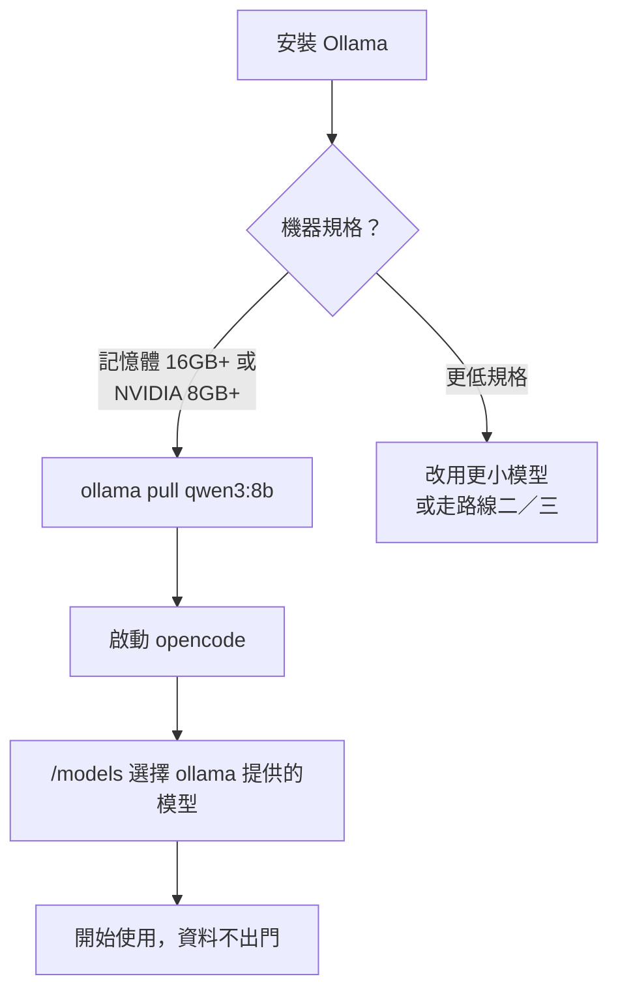
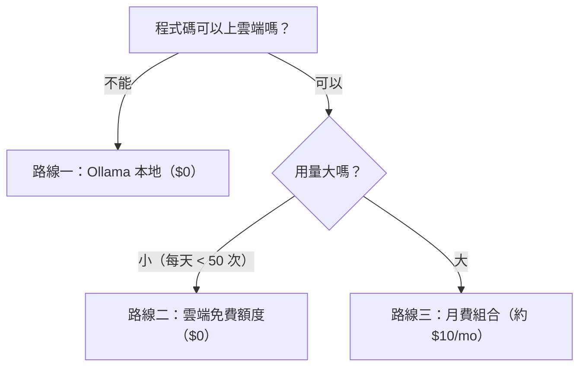

# 附錄 B：推薦免費模型列表

> 免費額度與定價變動很快。本附錄以「路線」為主軸，具體數字請以各供應商官網為準；完整的成本策略見第五冊。

## 路線一：完全本地（零元、零外流）

用 [Ollama](https://ollama.com) 在自己機器上跑開源權重。整條路線：



實際指令：

```bash
# 安裝 Ollama 後
ollama pull qwen3:8b          # 依機器規格選擇尺寸
opencode                      # 啟動後在 /models 選擇 ollama 提供的模型
```

| 建議 | 說明 |
|------|------|
| 適合誰 | 程式碼不能出門、想零成本長期使用的人 |
| 硬體門檻 | 16GB 記憶體起跳（7B~8B 級模型）；有 NVIDIA 顯卡更順 |
| 心理預期 | 能力約當雲端中型模型；複雜重構會吃力 |

## 路線二：雲端免費額度

部分供應商提供免費層級或每月贈送額度，適合輕度使用者：

| 供應商 | 免費內容（概況） | 備註 |
|--------|------------------|------|
| Google AI Studio | Gemini 系列有免費額度 | 申請門檻低，適合入門 |
| OpenRouter | 提供標記免費的開源模型 | 一把金鑰試多模型 |
| 各家開源模型官方 API | 不定期推出免費促銷 | 以 DeepSeek、Qwen 系最常見 |

> **注意**：免費層通常伴隨速率限制（每分鐘／每日請求上限）與較低的服務等級。寫書示範、假日專案夠用；生產環境請付費。

## 路線三：月費制平價組合

每月約 10 美元預算的建議配置（詳解見第五冊）：

1. 主力：一家平價供應商的標準模型（DeepSeek／Qwen 級）
2. 決策備援：免費額度的旗艦模型，留給關鍵設計問題
3. 本地小模型：跑量的小修改與格式處理

## 選擇決策樹


