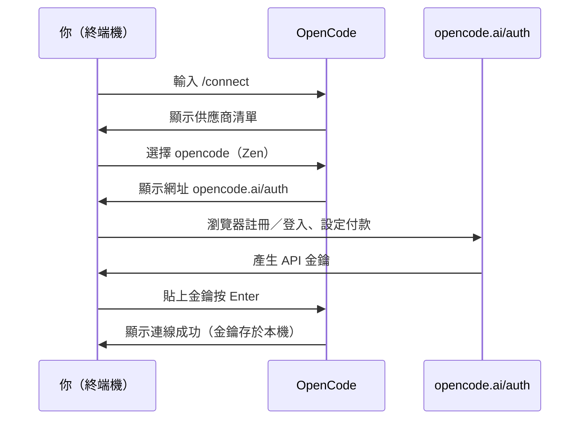

# 第 3 章：首次使用

> **本章學習目標**
>
> - 啟動 OpenCode 並看懂 TUI 畫面的基本元素
> - 透過 /connect 接上語言模型
> - 用 /init 產生 AGENTS.md，讓代理認識你的專案
> - 完成第一次對話，體驗「代理」與「聊天機器人」的差別
>
> **預估閱讀時間**：15 分鐘
> **實作時間**：約 15 分鐘

---

## 3.1 啟動 OpenCode

打開終端機，切換到任何一個你的專案資料夾（沒有的話先建一個測試用的空資料夾），輸入：

```bash
cd path/to/your-project
opencode
```

幾秒後你會看到 TUI 畫面展開：下方是輸入框，上方是對話區域，畫面角落有目前使用的模型與模式（Build／Plan）指示。這個介面完全用鍵盤操作——本章會用到的只有兩個鍵：**Enter** 送出訊息、**Esc** 取消或離開。

想先離開看看？按 `Ctrl+C` 兩次即可退出。

## 3.2 設定模型：/connect

OpenCode 沒有內建模型，第一次啟動必須接上一個「大腦」。在輸入框輸入：

```text
/connect
```

畫面會列出供應商清單。本書建議新手選擇第一項 **opencode**（官方 Zen 服務）：

1. 選擇 opencode 後，終端機會顯示一個網址：`https://opencode.ai/auth`
2. 在瀏覽器打開網址，註冊登入並完成付款設定
3. 複製頁面上產生的 API 金鑰
4. 回到終端機，把金鑰貼進輸入框按 Enter

看到連線成功的提示就完成了。之後 OpenCode 會記住這組金鑰，不會再問第二次。

完整流程的時序如下：



> **注意**：回顧第 1 章的三條紀律——貼金鑰的這個輸入框是安全管道，金鑰會被存放在本機的認證設定中，不要把金鑰貼到其他地方。

如果你想用特定大廠的模型（Anthropic、OpenAI、Google 等），在供應商清單選該家、貼上你在該廠後台申請的金鑰即可，流程相同。想完全免金鑰上路的人，附錄 B 有 Ollama 本地模型的快速指引。

## 3.3 專案初始化：/init 與 AGENTS.md

接上模型後，先別急著問問題。在專案根目錄執行：

```text
/init
```

你會看到代理開始工作：它翻讀你的專案結構、設定檔與原始碼，然後在專案根目錄產生一個 `AGENTS.md` 檔案。

<!-- SCREENSHOT-PENDING: /init 執行過程的 TUI 畫面（真實截圖或更精緻的文字模擬） -->

終端機裡的過程大致長這樣：

```text
> /init
● 正在分析專案結構……
● 讀取 package.json、src/、tests/……
● 產生 AGENTS.md

已建立 AGENTS.md（42 行）。內容涵蓋：專案用途、目錄導覽、
常用指令（dev/build/test）與程式碼慣例。
```

產出的檔案依專案而異，典型長相：

```markdown
# AGENTS.md

## 專案概述
筆記應用後端。Node.js + Fastify + PostgreSQL。

## 目錄導覽
- src/routes/   HTTP 路由
- src/services/ 業務邏輯
- src/db/       資料庫遷移與查詢

## 常用指令
- npm run dev    啟動開發伺服器
- npm test       跑測試（不要用 --watch）

## 慣例
- 新路由一律先寫 schema 驗證
- 錯誤統一拋給 errorHandler，不要在 route 內 try/catch
```

### AGENTS.md 是什麼

它是給 AI 看的「專案說明書」，通常包含：

- 專案的用途與技術棧
- 目錄結構導覽
- 建置、測試、執行的指令
- 團隊的程式碼慣例（命名風格、框架用法）

有了它，代理每次啟動都先讀取這份說明書，回答與修改的品質會明顯提升；沒有它，代理每次都要從零摸索你的專案。

### 務必納入版控

```bash
git add AGENTS.md
git commit -m "docs: 新增 AGENTS.md 專案說明"
```

把它當成 README 一樣維護：技術棧變了、指令變了，就更新它。團隊每個人（以及每個人的代理）都受益。

> **重點**：AGENTS.md 的品質直接影響代理的表現。寫得越具體（例如「測試用 `npm test`，不要用 watch 模式」），代理越少做傻事。第二冊第 7 章有完整的撰寫範本。

## 3.4 第一次對話

萬事俱備。試試這個經典提問：

```text
用三句話介紹這個專案在做什麼，以及主要的程式進入點在哪裡。
```

觀察它的行為：如果這是個有內容的專案，你會看到代理**自己呼叫工具**去讀檔案（畫面上會顯示類似 read 的工具呼叫過程），然後才回答。這就是第 1 章說的「代理」與「聊天機器人」的差別——它不是憑空猜測，而是真的去看了你的程式碼。

再試一個更貼近日常的：

```text
這個專案要怎麼跑起來？
```

如果 AGENTS.md 寫得好，它會直接引用其中的啟動指令回答。

### 提問的心法

跟代理說話的方式，很像帶一位能力很強但剛報到的資深新人：

- 給目標，也給背景：「我要加匯出功能，參考現有的會員查詢做法」優於「加個匯出功能」
- 指明位置：善用 @語法（下一章詳教）
- 一次一件事：任務切小，成功率遠高於一口氣丟三大需求

---

## 本章摘要 {.unnumbered .unlisted}

- `opencode` 啟動 TUI；`Ctrl+C` 兩次退出。
- `/connect` 接模型：新手走官方 Zen 路線最省事，金鑰只經由這個流程存放。
- `/init` 讓代理掃描專案並產生 AGENTS.md，這份「AI 專案說明書」要 commit 進 Git 並持續維護。
- 第一次對話就能觀察到代理自主讀檔的行為；提問像帶新人：給目標、給背景、一次一件事。

## 下章預告 {.unnumbered .unlisted}

能用之後，練好用。第 4 章帶你熟悉 TUI 的每個區塊與快速鍵，學會 @語法精準引用檔案、用拖曳圖片讓代理看懂截圖——這些小技巧累積起來，就是效率差距的來源。

## 延伸資源 {.unnumbered .unlisted}

- 官方入門文件：<https://opencode.ai/docs>
- AGENTS.md 慣例：<https://agentsmd.net>
