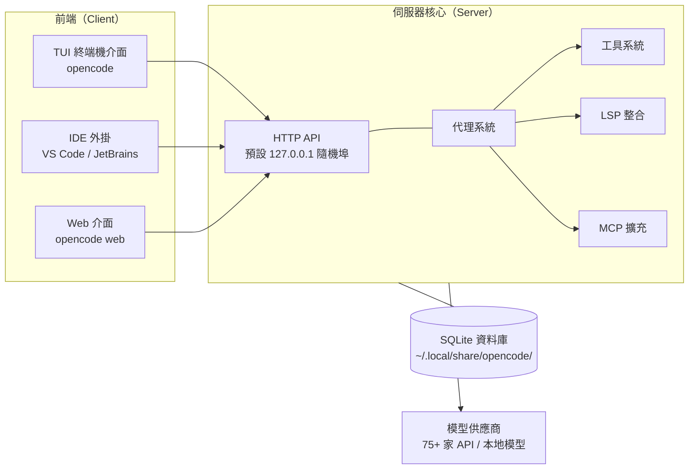

# 第 2 章：系統架構總覽

多數使用者不需要會寫 OpenCode 的原始碼，但需要理解它的形狀。這一章用一張圖、四根柱子，把系統架構講清楚——之後你遇到「為什麼 IDE 外掛和終端機看得到同一個會話」「伺服器開在哪個埠」「我的對話紀錄存在哪」這類問題，都能自己推出答案。

## 2.1 主從式架構

OpenCode 不是一個單體程式，而是標準的主從式架構（client-server）：一顆伺服器核心承載所有智能與狀態，前端只是不同的檢視方式。



這個設計帶來三個直接的好處：

**前端可替換，狀態只有一份**

你在終端機裡開到一半的會話，打開 VS Code 外掛可以看到同一份歷史；反過來也一樣。因為所有狀態都在伺服器端的資料庫裡，前端不保存任何關鍵資料。

**伺服器可以不在本機**

`opencode serve` 啟動無頭（headless）伺服器，`opencode attach http://主機:埠` 讓任何前端遠端連上去。把重活丟給公司的工作站、人在筆電上輕鬆操作，就是這麼來的：

```bash
# 在工作站上啟動無頭伺服器，固定埠 4096
opencode serve --port 4096 --hostname 0.0.0.0

# 在筆電上附加過去操作
opencode attach http://workstation.local:4096
```

**自動化有官方入口**

同一組 HTTP API 也是腳本與 CI 的整合點：`opencode run` 在命令列直接跑完一個代理任務並退出（第 15 章），`--format json` 則輸出原始事件流供程式消費。

## 2.2 技術棧：四根柱子

OpenCode 的技術選型可以用「快、響應式、統一模型層、嵌入式儲存」四個關鍵詞記住。

| 元件 | 技術 | 扮演的角色 |
|------|------|-----------|
| 執行環境 | Bun | JavaScript 執行環境與套件管理，冷啟動快，單檔執行檔發布 |
| 終端機介面 | SolidJS | 以細粒度響應式聞名的前端框架，讓 TUI 擁有接近圖形介面的流暢度 |
| 模型呼叫層 | Vercel AI SDK | 統一各家模型 API 的抽象層，這是「75+ 供應商」的技術基礎 |
| 本地儲存 | SQLite | 會話、訊息、工作階段狀態全部存在單一資料庫檔案 |

**Bun 負責跑得快**

OpenCode 以 Bun 作為執行環境，安裝包是獨立執行檔，不必先裝 Node.js。第一冊提過的 `curl -fsSL https://opencode.ai/install | bash` 一行安裝，背後拿到的就是 Bun 編譯產物。

**SolidJS 負責畫得順**

終端機 UI 最怕整個畫面重繪造成的閃爍。SolidJS 的細粒度響應式更新只重繪真正變化的部分，長會話捲動、串流輸出時的體驗因此明顯優於傳統做法。

**Vercel AI SDK 負責說各家的話**

每家模型供應商的 API 格式都不同。AI SDK 提供統一的串流介面，OpenCode 再往上疊自己的工具呼叫協定——所以切換模型時，工具系統與會話格式完全不受影響。

**SQLite 負責記得住**

你的所有會話就在這裡（實測路徑）：

```bash
ls ~/.local/share/opencode/
# auth.json    opencode.db    opencode.db-shm    opencode.db-wal    log/
```

`opencode.db` 是標準 SQLite 檔案，意味著你可以直接查詢、備份、甚至做分析。`opencode session list`、`opencode export` 這些指令都是它的官方讀取介面；`log/` 目錄則存放除錯日誌，第 22 章排障時會用到。

## 2.3 事件驅動概念

代理運作時發生的一切——你送出的訊息、模型的思考、工具的每一次呼叫與結果——都以事件的形式流經系統，寫入資料庫並廣播給所有連線中的前端。這解釋了幾個使用現象：

- **多前端同步**：IDE 外掛看到的進度與終端機一致，因為它們聽的是同一條事件流。
- **會話可以匯出**：`opencode export <sessionID>` 把事件序列轉成 JSON，可分享、可存檔、可重新匯入。
- **外掛能掛鉤**：外掛系統監聽特定事件（例如「工具即將執行」）插入自訂邏輯，第四冊會完整實作。

至於內部執行緒如何調度、非同步佇列怎麼設計，屬於第三冊《架構解密》的深度內容，這裡只需要建立「一切皆事件」的心智模型。

## 本章摘要 {.unnumbered .unlisted}

- OpenCode 是主從式架構：伺服器核心承載狀態與智能，TUI／IDE／Web 只是前端的殼，`serve`＋`attach` 可遠端作業。
- 四根柱子：Bun（執行環境）、SolidJS（響應式 TUI）、Vercel AI SDK（模型無關層）、SQLite（本地儲存）。
- 資料在 `~/.local/share/opencode/opencode.db`，設定在 `~/.config/opencode/`，兩者分離。
- 「一切皆事件」的心智模型，之後理解同步、匯出、外掛掛鉤都用得上。

## 下章預告 {.unnumbered .unlisted}

架構的引擎室裡坐著誰？第三章深入代理系統：build 與 plan 兩大主力如何分工、任務怎麼委託給子代理、以及最重要的——權限規則怎樣設計才能讓 AI 大膽做事又不踩紅線。

## 延伸資源 {.unnumbered .unlisted}

- CLI 全覽：`opencode --help`
- 無頭模式：`opencode serve --help`、`opencode attach --help`
- 官方文件〈Architecture〉：<https://opencode.ai/docs/>
