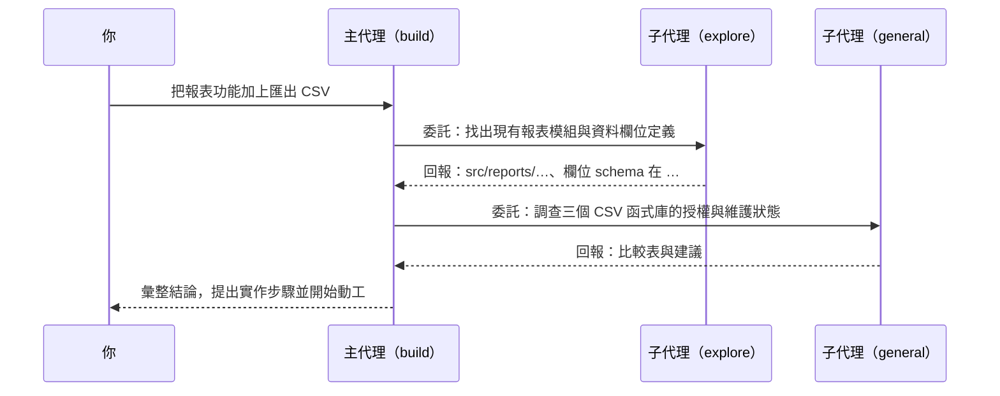

# 第 3 章：代理系統

「代理」這個詞在 OpenCode 裡有精確的含義：一組決定 AI 如何行事的設定——系統提示、可用工具、權限規則、模型選擇——打包成一個可切換的身分。同一顆引擎，穿上不同的代理設定，就是不同的工作夥伴。這一章拆解內建代理、委託機制與權限設計，這是全書後續所有實戰章節的地基。

## 3.1 內建代理一覽

OpenCode 內建四個可直接使用的代理，各有明確的職守：

| 代理 | 定位 | 修改檔案 | 適用場景 |
|------|------|----------|----------|
| build | 主力開發者 | 可以 | 實作功能、修 Bug，一切「動手做」的任務 |
| plan | 架構顧問 | 唯讀分析 | 需求釐清、方案比較、產出實作計畫 |
| general | 通用研究員 | 可以（獨立子會話） | 被委託的多步驟調查與執行 |
| explore | 程式碼偵察兵 | 唯讀 | 快速回答「程式碼在哪裡／怎麼運作」 |

兩個補充說明：

第一，除了上表四個，系統內部還有 compaction（上下文壓縮）與 title（會話命名）等隱藏代理，它們由系統自動呼叫，不必也不該手動選用。

第二，用 CLI 就能列出目前環境可用的代理：

```bash
opencode agent list
```

**build 對 plan 的黃金分工**

初學者最常犯的錯，是對著 build 直接丟一句「幫我做一個購物車」，然後看著它往不可預期的方向狂奔。正確節奏是先 plan 後 build：

```text
你（plan 模式）：我想加購物車功能，先盤點要動哪些模組，
                 有哪些方案，風險在哪。
AI（plan）：     （唯讀探索專案後）三個方案……建議 B，
                 分五個步驟，每一步影響範圍如下……
你（確認方案 B）
你（build 模式）：按剛才計畫的第 1 步開始實作。
AI（build）：     （動手改碼、跑測試、回報結果）
```

plan 代理被刻意拿走了寫入工具，所以它「只能想，不能做」——這不是限制，而是保護：構思階段的任何試探都不會弄髒你的工作目錄。

## 3.2 代理委託機制

主代理不必事必躬親。透過 task 工具，它可以把自己的子任務委託給另一個代理，在獨立的子會話中完成後回收成果。你在介面裡看到的「子任務」摺疊區塊，就是委託發生的現場。



委託的價值在於**上下文隔離**：子代理翻遍二十個檔案找到答案，過程產生的雜訊留在子會話裡，只有結論回到主會話。主代理的上下文視窗因此保持乾淨，長任務不容易因為塞滿無關細節而變笨。

使用上的兩個心法：

- **偵察交給唯讀代理**。「先搞清楚狀況」類的問題指名走 explore，避免 build 一時技癢順手改了東西。
- **重活明確驗收條件**。委託詞裡寫清楚「完成定義」（要改哪些檔案、要通過哪個測試），子代理的輸出品質會截然不同。

## 3.3 權限規則設計

權限系統回答一個問題：AI 想做某件事時，要不要先問過你？三種層級：

- `allow`：直接放行，不問。
- `ask`：每次跳出確認，你按同意才執行。
- `deny`：直接拒絕，連問都不用。

設定寫在 `opencode.json` 的 `permission` 區塊，支援萬用字元：

```json
{
  "$schema": "https://opencode.ai/config.json",
  "permission": {
    "edit": "allow",
    "bash": {
      "git status": "allow",
      "git push*": "ask",
      "rm -rf *": "deny",
      "*": "ask"
    },
    "webfetch": "allow"
  }
}
```

這份設定的語意：檔案編輯全面放行；`git status` 不必問；`git push` 開頭的指令每次確認；任何 `rm -rf` 一律禁止；其餘 shell 指令逐次確認。

三條實戰經驗：

**從嚴起步，逐步放行。** 新專案先用預設（多數操作會問），觀察一週 AI 的行為模式，再把高頻且安全的操作加進 `allow`。反向流程（先鬆後緊）往往在第一次事故後才開始收緊。

**規則比直覺可靠。** 「我會盯著它」不是安全策略——串流輸出飛快掠過時你根本盯不住。危險指令一律寫成 `deny` 或 `ask`。

**權限跟著環境走。** 個人側專案可以寬鬆，公司生產庫的專案層設定應該嚴格（第 7 章）。設定合併的優先序在第 12 章完整展開。

## 本章摘要 {.unnumbered .unlisted}

- 代理＝系統提示＋工具集＋權限＋模型的一組封裝；切換代理就是切換工作身分。
- 內建四代理：build（動手）、plan（唯讀規劃）、general（受託執行）、explore（唯讀偵察）；「先 plan 後 build」是品質最低成本的保障。
- task 工具把子任務委託給其他代理，上下文隔離讓主會話保持乾淨。
- 權限三層 allow／ask／deny，寫進 `opencode.json` 的 `permission`；從嚴起步、以規則取代盯梢。

## 下章預告 {.unnumbered .unlisted}

代理是決策者，工具是手腳。第四章盤點內建工具家族：檔案讀寫為什麼要有「多層回退比對」、搜尋工具怎麼分工、以及模型能力差異（例如 GPT 系的 apply_patch）如何被架構吸收掉。

## 延伸資源 {.unnumbered .unlisted}

- 代理管理：`opencode agent --help`
- 官方文件〈Agents〉：<https://opencode.ai/docs/agents/>
- 自訂代理的完整教學見本系列第四冊《OpenCode 擴展開發》
