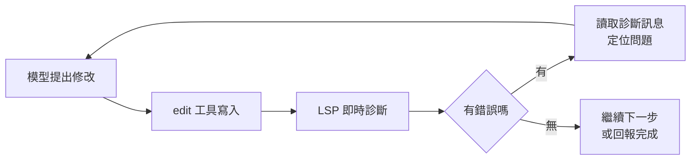

# 第 9 章：LSP 整合

AI 改完程式碼說「完成了」，但編譯器不認同——這是所有代理工具的經典翻車場景。OpenCode 的對策是把語言伺服器協定（LSP）直接整合進代理的工作環境：AI 寫的每一行碼，都有編譯器等級的即時檢查在背後把關。這章講清楚 LSP 是什麼、OpenCode 怎麼用它，以及它如何改變 AI 編碼的品質曲線。

## 9.1 語言伺服器協定基礎

LSP 是微軟為 VS Code 制定的標準協定，把「語言智慧」從編輯器中拆出來，變成獨立的伺服器行程。Python 的 pyright、TypeScript 的 tsserver、Rust 的 rust-analyzer——它們都懂同一套協定，提供四種核心能力：

| 能力 | 說明 | 對 AI 的意義 |
|------|------|--------------|
| 診斷 | 錯誤、警告即時回報 | 改完立刻知道有沒有改壞 |
| 定義跳轉 | 符號在哪裡定義 | 追蹤呼叫鏈不必靠文字搜尋 |
| 引用查找 | 誰在用這個符號 | 重構前評估影響範圍 |
| 符號大綱 | 檔案的結構視圖 | 快速理解程式組織 |

關鍵差別在於：grep 只懂「字串」，LSP 懂「語意」。搜尋 `user.name` 能找到同名文字，卻分不清那是資料欄位還是另一個模組的同名變數；LSP 可以。

## 9.2 內建 LSP 自動載入

OpenCode 內建對四十多種語言的 LSP 支援，而且採「零設定」哲學：你打開一個 TypeScript 專案，它就載入 typescript-language-server；打開 Python 專案，就載入 pyright。對應的語言伺服器若未安裝，系統會偵測並提示安裝——你只需決定允許或婉拒，選擇會記錄下來不再重複詢問。

實務上你幾乎不需要管理它，但兩件事值得知道：

**確認目前載入了什麼**

```bash
ls ~/.config/opencode/
# lsp-install-decisions.json 就在這裡——你的安裝決策紀錄
```

TUI 內輸入 `/status` 可以看到各子系統（LSP、MCP、外掛）的就緒狀態。

**版本歸誰管**

LSP 伺服器的安裝由 OpenCode 代管，跟著專案走；你原來的編輯器（VS Code 等）裝的另一份互不干擾。

## 9.3 AI 與 LSP 協作：診斷回饋迴圈

LSP 整合真正的價值，是讓代理具備了**自我驗證的能力**。沒有 LSP 時，AI 的修改迴圈是：

```text
猜 → 改 → 「應該可以吧」→ 你跑測試發現爆了 → 回報 → 再猜
```

有了 LSP，迴圈變成：



AI 在每次編輯後主動查詢診斷結果，發現型別錯誤或未定義引用就當場修正——大部分低級錯誤在你看到之前就已經死在迴圈裡。這就是為什麼同樣的模型，在 OpenCode 裡的交付品質顯著高於貼到網頁聊天室問答案。

**使用者的三個配套習慣**

1. **保持 LSP 健康**。大型單體專案第一次開啟時，語言伺服器需要時間建立索引；索引沒好之前的診斷不可信，等 `/status` 顯示就緒再開工。
2. **診斷不是聖旨**。LSP 只懂單一語言的靜態規則，跨服務的邏輯錯誤、執行期行為仍要靠測試。第 15 到 17 章的工作流都是「LSP 把關靜態、測試把關動態」的雙層結構。
3. **多語言混合專案特別受益**。前後端同庫的專案，AI 在 TypeScript 與 Python 之間穿梭時，兩邊各有伺服器盯著，跨界引用錯誤無所遁形。

## 本章摘要 {.unnumbered .unlisted}

- LSP 提供語意級的四種能力：診斷、定義跳轉、引用查找、符號大綱；比文字搜尋懂「意思」。
- OpenCode 內建 40+ 語言的自動載入，零設定起步，伺服器代管、按需提示安裝，`/status` 可查就緒狀態。
- 最大價值是診斷回饋迴圈：AI 每次編輯後即時自查，低級錯誤在送達你之前就被消滅。
- LSP 管靜態規則，測試管動態行為，兩層防線缺一不可。

## 下章預告 {.unnumbered .unlisted}

LSP 讓 AI 看懂程式碼，MCP 則讓 AI 觸及整個世界——資料庫、瀏覽器、專案管理平台都能變成它的工具。第十章拆解 Model Context Protocol 的概念、設定與安全管控。

## 延伸資源 {.unnumbered .unlisted}

- 官方文件〈LSP〉：<https://opencode.ai/docs/lsp/>
- LSP 協定規格：<https://microsoft.github.io/language-server-protocol/>
