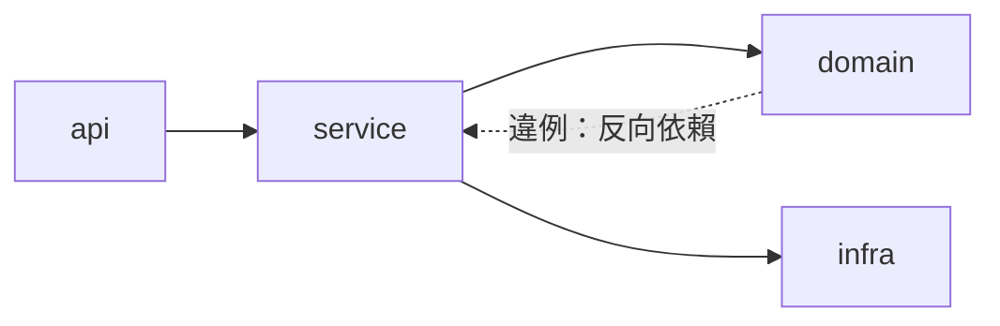

# 第 14 章：程式碼探索與理解

實務上最常見的開場不是「寫新功能」，而是「接手一坨看不懂的程式碼」——可能是前人留下的遺產、開源專案的原始碼，或你自己半年前的作品。傳統做法是逐檔翻閱加腦內補完；有了代理，正確做法是把它當成一個可以隨時提問的資深同事。這章給出一套可重複的偵察流程。

## 14.1 快速上手陌生程式碼庫

**第一步：先跑起來，再談理解**

理解程式最好的方式是觀察它的行為。clone 下來的第一小時，目標只有一個：本地跑起來、打開主要頁面或 API、戳幾下核心功能。這一步 AI 能幫的是讀 README、推斷啟動指令、排除環境問題：

```text
剛 clone 這個專案。讀一下 README 和設定檔，
告訴我本地啟動需要哪些前置（資料庫？環境變數？），
並列出你建議的啟動步驟。
```

**第二步：三分鐘全景圖**

跑得起來之後，讓 explore 代理畫第一張地圖：

```text
用 explore 掃描這個儲存庫，回答：
1. 技術棧與主要框架版本
2. 頂層目錄各自的職責（一句話一個）
3. 程式進入點在哪
4. 有沒有明顯的分層架構（如 MVC、Clean Architecture）
```

explore 是唯讀代理，放心讓它大範圍掃——它不會動你的檔案，而且子會話的探索雜訊不會汙染主對話（第 3 章的委託機制）。

**第三步：沿著一條主流程走到底**

抽象的全景圖記不牢，具體的流程才記得住。挑一條核心業務路徑（例如「使用者送出訂單」），請代理做端到端追蹤：

```text
追蹤「使用者建立訂單」的完整呼叫鏈：
從 HTTP 路由進來之後經過哪些函式、哪些資料表被寫入、
哪裡發事件給其他服務。
輸出成一份帶檔名與行號的清單。
```

帶行號的輸出是關鍵——之後你隨時能跳回現場驗證，而不是接受一段無法複查的口頭摘要。

**第四步：把理解沉澱成文件**

偵察結果不要只留在會話裡。兩個去處：

- 更新 AGENTS.md 的目錄導覽區塊（第 7 章）——下次 AI 不必重新摸索。
- 請代理把呼叫鏈整理成 Mermaid 圖存進 docs/——給下一個接手的人（也給未來的你）。

## 14.2 架構分析與依賴梳理

比「怎麼跑」更深的問題是「怎麼長的」。三種高頻分析任務的做法：

**依賴方向健檢**

分層架構最大的隱患是依賴方向失控（底層反過來 import 上層）。交給代理：

```text
檢查 internal/domain/ 是否有 import internal/api/ 或
internal/infra/ 的情況。有的話列出完整清單，
這些都是違反分層原則的位置。
```

**循環依賴偵測**

模組間互相引用是腐化的起點。請代理繪製模組級依賴圖，環狀結構在圖上一眼即見：



**改動影響評估**

動手前的必做題：「我想把 X 模組的介面改成 Y，有哪些地方會受影響？」LSP 的引用查找（第 9 章）加上代理的交叉分析，能給出比人工直覺可靠得多的清單。

**分析的產出品質檢核**

AI 的架構分析可能自信地講錯。三道防線：要求每個論斷附檔案行號；抽查兩三處關鍵宣稱；重大決策（如重構方向）永遠自己看過原始碼再拍板。信任但要驗證，在程式碼理解上是字面意義的操作守則。

## 本章摘要 {.unnumbered .unlisted}

- 上手陌生程式庫的四步：先跑起來、explore 畫全景、沿主流程端到端追蹤、把理解沉澱進 AGENTS.md 與文件。
- 追蹤輸出必須帶檔名與行號，可複查的結論才是有用的結論。
- 三種高頻分析：依賴方向健檢、循環依賴偵測（配 Mermaid 圖）、改動影響評估（配 LSP）。
- 對 AI 的架構分析保持「信任但驗證」：要出處、抽樣查、大事自己看碼。

## 下章預告 {.unnumbered .unlisted}

看得懂之後，該學怎麼做得好。第十五章功能開發的完整節奏：Plan 模式的需求分析術、迭代開發的迴圈設計，以及每一步的驗收紀律。

## 延伸資源 {.unnumbered .unlisted}

- explore 代理用法複習：本書第 3 章
- 第一冊第 7 章複習：讓 AI 讀懂專案的基礎方法
