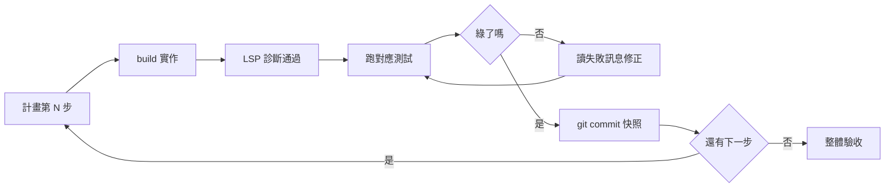

# 第 15 章：功能開發

功能開發是代理最擅長、也最容易翻車的場景——翻車的原因幾乎都不是模型不夠聰明，而是流程不對。這章給出一條經過大量實戰淬鍊的節奏：需求分析用 Plan 模式打底，實作走小步迭代，每一步都有明確的驗收動作。

## 15.1 需求分析與 Plan 模式實作

**為什麼先 Plan**

直接對 build 說「做個匯出功能」，等於把三個決策（做成什麼樣、放哪裡、怎麼驗證）全部讓渡給 AI 的第一印象。Plan 模式的價值是把決策拉回檯面上：它只能讀不能寫，所以會專注產出一份「值得你審查的計畫」。

**一次合格的 Plan 對話長這樣**

```text
切到 plan 代理。

需求：訂單列表頁要能匯出 CSV。
背景：目前列表頁由 OrderListPage 元件呼叫 /api/orders 分頁介面。
限制：
- 單次最多匯出 5000 筆
- 匯出欄位與畫面顯示欄位一致
- 後端直出檔案流，不要前端組字串

請產出實作計畫：改動檔案清單、每個檔案的變更摘要、
測試計畫、以及你看到的風險點。先不要動任何程式碼。
```

注意提示詞裡的三層結構：**需求**（要什麼）、**背景**（現狀錨點）、**限制**（邊界）。加上明確的輸出格式要求（檔案清單、變更摘要、測試計畫、風險），你拿到的就是一份可以直接 review 的工程文件。

**審查計畫的四個檢查點**

1. 改動範圍合理嗎？動了五個檔案卻漏了你直覺該有的那一個，通常是理解有偏差。
2. 測試計畫具體嗎？「補充測試」四個字不合格，「新增 orders-export.test.ts 覆蓋空結果與上限截斷」才合格。
3. 風險點誠實嗎？說「沒有風險」的計畫比承認三個風險的更可疑。
4. 有沒有偷偷擴大範圍？順手重構是代理的天性，計畫階段就要攔下來。

## 15.2 迭代開發流程

計畫核准後切回 build 開工。核心紀律是**小步快跑，步步驗收**：



**步驟粒度的藝術**

一次 commit 對應一個可驗證的最小行為。「完成整個匯出功能」太大；拆成「後端端點回傳 CSV 檔案流」「前端按鈕觸發下載」「上限截斷與提示」三步，每步都能獨立驗證獨立提交。

**驗收指令前置**

在 build 開工前就告訴它驗證方式，省掉來回：

```text
照計畫執行第 1 步。完成的定義：
uv run pytest tests/test_orders_export.py -q 全綠，
且 curl 打新端點能看到 CSV 表頭。
```

**中途變更怎麼辦**

實作中發現計畫有誤（例如發現既有程式已經有半套匯出邏輯）——正確行為是停下來回報並提出修正方案，而不是自作主張繞路。這條規則值得寫進 AGENTS.md：「實作中偏離計畫時，暫停並先取得確認」。

**收尾三部曲**

全部步驟完成後：跑全量測試（不是只跑新測試）、自己操作一遍真實流程、請代理生成提交訊息並分批 commit（第 18 章有訊息規範）。到此才算交付。

## 本章摘要 {.unnumbered .unlisted}

- Plan 先行的本質是把決策拉回檯面；提示詞三層結構＝需求＋背景＋限制，輸出格式要指名道姓。
- 審計劃看四件事：範圍合理性、測試具體性、風險誠實度、範圍膨脹徵兆。
- 實作紀律：小步迭代、LSP＋測試雙層驗收、步步 commit 快照；驗收指令在開工前給足。
- 偏離計畫必須停下回報；收尾要全量測試加真人操作一遍。

## 下章預告 {.unnumbered .unlisted}

功能是從零到一，重構是把已有的東西變好而不弄壞。下一章的重構章談策略選擇與安全網設計——測試先行與 git 快照如何組成你的雙保險。

## 延伸資源 {.unnumbered .unlisted}

- plan／build 分工複習：本書第 3 章
- 官方文件〈Agents〉：<https://opencode.ai/docs/agents/>
